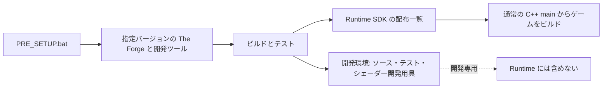

# gkcore

gkcore は Windows 向けの C++ ゲーム描画フレームワークです。利用者は `<gkcore.h>` と `gk::` 関数から始め、The Forge の API を直接扱いません。

```cpp
#include <gkcore.h>

int main()
{
    if (gk::SetWindowSize(1280, 720) != 0)
    {
        return 1;
    }
    if (gk::Init() != 0)
    {
        return 1;
    }

    while (gk::ProcessEvents() && !gk::IsKeyDown(gk::Key::Escape))
    {
        if (gk::BeginFrame() != 0)
        {
            break;
        }
        if (gk::SetDrawLayer(gk::DrawLayer::Scene) != 0)
        {
            break;
        }
        if (gk::DrawRect(32.0f, 32.0f, 208.0f, 112.0f, gk::ColorRGB(70, 150, 240), true) != 0)
        {
            break;
        }
        if (gk::SetDrawLayer(gk::DrawLayer::UI) != 0)
        {
            break;
        }
        if (gk::DrawString(32.0f, 660.0f, "Escape キーで終了", gk::ColorRGB(255, 255, 255)) != 0)
        {
            break;
        }
        if (gk::Present() != 0)
        {
            break;
        }
    }

    gk::Shutdown();
}
```

描画部は Scene 層の 2D・3D を HDR 描画先へまとめ、Bloom、露出・トーンマッピング、彩度・コントラスト、FXAA を適用してから UI 層を合成します。PNG / BMP 画像のスプライト描画、OBJ / GLB 2.0 / FBX の静的モデル読み込み、ウィンドウサイズ変更、システム標準フォントを使う `gk::DrawString` も実装しています。

HLSL で書いたピクセルシェーダーを 2D・3D の描画に設定する経路も実装しました。[色を変えるサンプルと使い方](docs/custom-shader.md)を用意しています。

Scene 全体に適用する HLSL ポストシェーダーの使い方は[別ガイド](docs/post-effect-shader.md)にまとめています。

## 2D・3D とエフェクト

矩形は塗りつぶしと輪郭を選べます。線幅は `gk::DrawRectOutline` で指定します。[使い方とサンプル](docs/rectangles.md)を参照してください。

GLB モデルには方向光と一様な環境光を設定できます。サンプルでは、非金属と金属の球を並べ、キー操作で光の向きを変えます。[モデル照明のガイド](docs/lighting.md)と[実行例](examples/model_lighting.cpp)を参照してください。

Scene の 2D と 3D を同じ描画先へ重ね、Bloom、露出・トーンマッピング、色調整、必要に応じた FXAA を適用してから UI を合成します。図は処理順を示します。


## 開発と SDK

The Forge の開発用ソース、シェーダーコンパイラー、テスト、ビルド用スクリプトは開発環境に置きます。ゲーム開発者へ渡す Runtime SDK には、ヘッダー、ライブラリ、実行に必要なファイルだけを含めます。



開発には Windows 10/11 x64、Python 3.9 以降、Windows SDK 10.0.22621.0、Visual Studio 2022 または Visual Studio 2026 の C++ 開発環境と v142 14.29 toolset が必要です。CMake の要件は Visual Studio 2022 では 3.21 以降、Visual Studio 2026 では 4.2 以降です。`PRE_SETUP.bat` は The Forge と DXC 1.8.2405 の SHA-256 を確かめ、依存物と gkcore の FSL シェーダーをビルドした後、ライブラリ、サンプル、テストをビルドします。Runtime から STL を除く方針で、テストや開発ツールは別に保ちます。[開発ガイド](docs/development.md) と [機能サポート状況](docs/ROADMAP.md) を参照してください。

Windows 11 Pro x64、Visual Studio 2026/v142、Windows SDK 22621、CMake 4.3.1、RTX 4070 SUPERでRelease Runtimeと`PRE_SETUP.bat --gpu-check`を実行し、最新のRelease/Debug確認ではCTestがそれぞれ35/35成功しました。GPU画素検査では基本描画・モデル照明と、6フレーム中の効果切り替え・UIの色維持を確認し、mixed_sceneとmodel_lightingを目視しました。これは全面的な画質判定ではありません。CPU-only Debug/Release CTestと、両Runtime構成のSDK consumer smokeも確認済みです。Debugを使う場合は`PRE_SETUP.bat --configuration Debug --gpu-check`を実行します。詳細と未確認事項は[GPU描画検証](docs/render-validation.md)、[機能とサポート状況](docs/ROADMAP.md)、[TDD 検証ログ](docs/TDD_LOG.md)を参照してください。

## 詳細

- [クイックスタート](docs/quickstart.md)
- [キー入力](docs/input.md)
- [モデルの読み込み](docs/models.md)
- [モデル照明の使い方](docs/lighting.md)
- [輪郭矩形](docs/rectangles.md)
- [ポストエフェクトの使い方](docs/effects.md)
- [完成仕様](docs/PRODUCT_SPEC.md)
- [カスタムシェーダー開発](docs/custom-shader.md)
- [ポストエフェクト用シェーダー](docs/post-effect-shader.md)
- [配布物と開発物](docs/package-layout.md)
- [TDD 検証ログ](docs/TDD_LOG.md)
