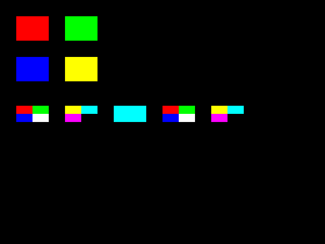
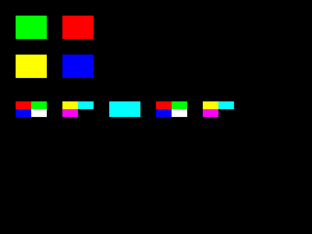

# カスタムピクセルシェーダー

HLSL でピクセルシェーダーを作り、開発用コンパイラーで gkcore 用のコンパイル済みファイルに変換してから `gk::LoadPixelShader` で読み込みます。
実行時に HLSL をコンパイルする必要はありません。
描画命令用シェーダーと Scene 全体へ適用するポストシェーダーは、選択 API と適用時点が異なります。
後者は[ポストエフェクト用シェーダーのガイド](post-effect-shader.md)を参照してください。

## シェーダーの入力と定数

`<gkcore/Shader.hlsl>` が共通のピクセル入力とリソース名を定義します。
自分で頂点シェーダーを書く必要はなく、gkcore が渡す次の入力から `float4` の色を返します。

| HLSL 名 | 意味 |
|---|---|
| `GkcorePixelInput.position` | 画面上の位置 (`SV_Position`) |
| `GkcorePixelInput.color` | 描画命令から渡される色 (`COLOR0`) |
| `GkcorePixelInput.uv` | 画像の UV 座標 (`TEXCOORD0`) |
| `gkcoreUserData[0..63]` | `gk::SetShaderFloat4` で指定する 64 個の定数 (`b0, space3`) |
| `gkcoreTexture` / `gkcoreSampler` | 必要な場合に使う画像と sampler (`t0` / `s0, space0`) |

ピクセルシェーダーの戻り値は `SV_Target0` に出力します。
`examples/shaders/tint.hlsl` は、描画色に定数 slot 0 の tint を掛ける最小例です。

```hlsl
#include <gkcore/Shader.hlsl>
float4 main(GkcorePixelInput input) : SV_Target0
{
    return input.color * gkcoreUserData[0];
}
```

画像を使う shader では `gkcoreTexture.Sample(gkcoreSampler, input.uv)` を色に掛けられます。
`DrawImage` のときはその画像が binding され、画像を使わない描画では白い texture が渡ります。
画像の GPU 転送とスプライト描画経路は gkcore 側で用意します。

## コンパイル

HLSL ソースは開発用ツールでコンパイルします。
The Forge と DXC 1.8.2405 を `PRE_SETUP.bat` で取得した開発環境から、次を実行します。

```bat
python tools/compile_pixel_shader.py --dxc-root .devtools/dxc-1.8.2405 --input examples/shaders/tint.hlsl --output build/tint.frag
```

出力される `.frag` は DXIL ピクセルシェーダーを FSL 形式に包んだコンパイル済みファイルです。
`gk::LoadPixelShader` はこの形式を読み込みます。
shader の配布では、このファイルと実行に必要な DLL を Runtime SDK に含めます。
DXC コンパイラーの実行ファイルや開発スクリプト、The Forge の開発用ソースは含めません。

## アプリから使う

shader を選択してから描画命令を追加します。
定数はその値を設定した後にキューへ追加した各描画命令へ複写されます。
shader を使わない描画には無効 handle を選び、内蔵 shader に戻します。
未設定の定数slotは0です。
`DeleteShader`は、そのshaderを参照するフレームが開いている間は失敗します。
`Present`後に解放し、削除済みhandleは使い直さないでください。
画像の`DeleteImage`には登録済み描画を保持する別の契約があります。

次のコードは描画命令用shaderの使い方です。
Sceneの矩形へshaderを適用し、UIの文字には内蔵shaderを使います。

```cpp
#include <stdio.h>
#include <gkcore.h>
/**
 * APIが失敗した場合に操作名と診断を出力する。
 */
bool Check(int result, const char* operation)
{
    if (result == 0)
    {
        return true;
    }
    fprintf(stderr, "%s: %s\n", operation, gk::GetLastErrorMessage());
    return false;
}
/**
 * 定数で描画色を変え、Escapeかウィンドウを閉じる操作で終了する。
 */
int main()
{
    if (!Check(gk::SetWindowSize(960, 540), "SetWindowSize") || !Check(gk::Init(), "Init"))
    {
        gk::Shutdown();
        return 1;
    }
    // Sceneの矩形へ適用するコンパイル済みshader。
    const gk::ShaderHandle tint = gk::LoadPixelShader("build/tint.frag");
    if (!tint.IsValid())
    {
        fprintf(stderr, "LoadPixelShader: %s\n", gk::GetLastErrorMessage());
        gk::Shutdown();
        return 1;
    }
    // 描画と解放の失敗を終了コードへ反映する。
    bool passed = true;
    while (passed)
    {
        if (!gk::ProcessEvents())
        {
            // 通常のウィンドウ終了では空、処理失敗時は原因が入る。
            const char* diagnostic = gk::GetLastErrorMessage();
            if (diagnostic[0] != '\0')
            {
                fprintf(stderr, "ProcessEvents: %s\n", diagnostic);
                passed = false;
            }
            break;
        }
        if (gk::IsKeyDown(gk::Key::Escape) || gk::WasKeyPressed(gk::Key::Escape))
        {
            break;
        }
        passed = Check(gk::BeginFrame(), "BeginFrame") && Check(gk::SetDrawLayer(gk::DrawLayer::Scene), "SetDrawLayer(Scene)") && Check(gk::SetShaderFloat4(tint, 0, gk::Float4{1.0f, 0.55f, 0.55f, 1.0f}), "SetShaderFloat4") && Check(gk::SetPixelShader(tint), "SetPixelShader") && Check(gk::DrawRect(80.0f, 80.0f, 240.0f, 140.0f, gk::ColorRGB(255, 255, 255), true), "DrawRect") && Check(gk::SetPixelShader(gk::ShaderHandle{}), "SetPixelShader(built-in)") && Check(gk::SetDrawLayer(gk::DrawLayer::UI), "SetDrawLayer(UI)") && Check(gk::DrawString(24.0f, 24.0f, "Escape キーで終了", gk::ColorRGB(255, 255, 255)), "DrawString") && Check(gk::Present(), "Present");
    }
    // 正常時はPresent後に解放し、失敗時に残る資源はShutdownで片付ける。
    passed = Check(gk::DeleteShader(tint), "DeleteShader") && passed;
    gk::Shutdown();
    return passed ? 0 : 1;
}
```

定数slot 0と63を使う検査用shaderで、同じフレームへ異なる色と画像を登録しました。
最初のフレームは、slot 63を設定する前の矩形が黒になり、未設定の定数が0であることも確認しています。



上段のScene矩形はslot 0で赤・緑、2段目のUI矩形はslot 63で青・黄を指定しています。
次のフレームではそれぞれの色を入れ替えます。
最後に両slotの値を0へ変更してからPresentしても、登録済みの矩形は登録時の色を保ちました。



下段には2つのPNGをSceneとUIへ各1枚ずつ描きます。
左側の2枚がScene、右側の2枚がUIです。
中央のcyan矩形は画像を指定せずに描き、白い代替画像と描画色の入力を確認しています。

同じアプリで6回Presentし、偶数フレーム同士・奇数フレーム同士は画像全体が一致しました。
PNGと固定色の領域は6フレームすべてで一致しました。
使用中のshaderを削除する呼び出しは診断付きで拒否され、6回のPresent後は削除が成功しました。
削除済みhandleを再選択する呼び出しも拒否されました。

Runtimeの不具合を見つけて修正した結果ではありません。

検査用shaderはbuild時に生成し、Runtime SDKには含めません。

全64slot、4096件上限、半透明の独自shader、3D深度検査、shaderを指定したモデル描画、GPU負荷、全面画像の画質、他GPUの検証ではありません。

MASK材質のGLBモデルは内蔵モデルshaderで描きます。
描画命令用の独自pixel shaderを選んでMASKモデルを登録すると、材質の切り抜き条件を渡す入力がないためPresentが診断付きで失敗します。
`gk::SetPixelShader({})`で内蔵shaderへ戻してください。
対応する材質の設定は[モデルガイド](models.md)を参照してください。

## 現在の対応範囲

公開 API は shader handle、64 個の `Float4` 定数、描画命令ごとの設定 snapshot を提供し、1 フレームあたり独自 shader を使う描画は最大 4096 件です。
D3D12 描画部は共通の頂点シェーダーを使い、Scene/UI、深度検査、alpha blending の pipeline を用意しています。
独自の頂点 shader と利用者が差し替えるモデル材質 shader ABI は対象外です。
モデル描画は gkcore 内蔵の PBR 材質 shader を使います。
ポストエフェクト用 shader API と CPU 契約も統合済みで、[専用ガイド](post-effect-shader.md)に使い方をまとめています。
全面画像の画質判定とは分けて扱います。
