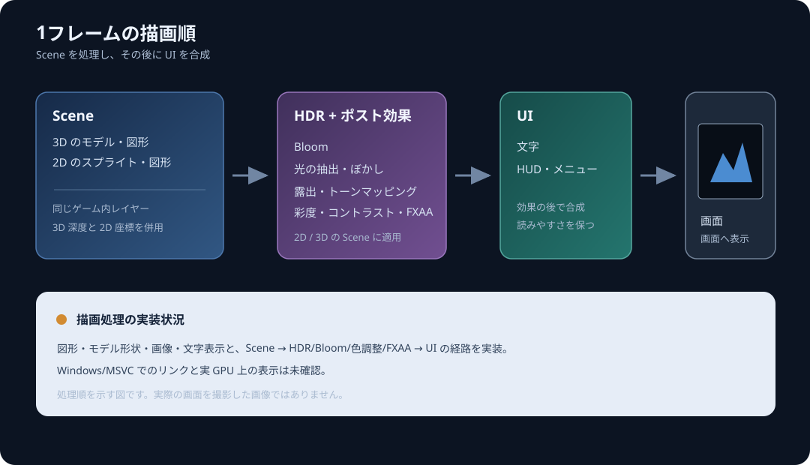
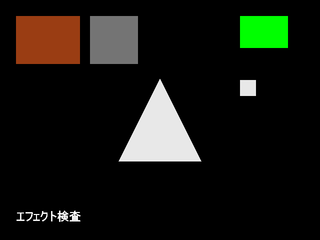
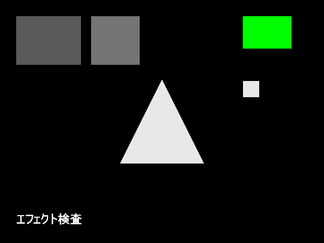

# ポストエフェクトの使い方

gkcore は Scene 層の 2D と 3D を HDR 描画先へまとめ、Bloom、露出・トーンマッピング、色調整、FXAA の順に処理してから UI 層を重ねます。たとえばゲームの背景やキャラクターに効果をかけたまま、HUD や文字を読みやすく表示できます。

## まずは少しだけ調整する

設定は初期化前にも変更できます。フレームごとに調整する場合は `gk::BeginFrame()` より前に setter を呼びます。次の値は、少し彩度を上げ、コントラストを加え、FXAA を有効にする例です。

```cpp
if (gk::SetSaturation(1.1f) != 0 ||
    gk::SetContrast(1.05f) != 0 ||
    gk::SetFxaaEnabled(true) != 0) {
    gk::Shutdown();
    return 1;
}
```

設定は `gk::BeginFrame()` で取り込まれます。フレーム途中に値を変えた場合は、次に始めるフレームから反映されます。ゲームの設定画面などから毎フレーム変更する場合も、`BeginFrame()` より前に setter を呼んでください。

## 設定できる値

| 関数 | 範囲・初期値 | 内容 |
|---|---|---|
| `gk::SetBloomEnabled(bool)` | 初期値 `true` | 明るい部分から光のにじみを作ります。 |
| `gk::SetBloomIntensity(float)` | `0` から `4`、初期値 `0.15` | Bloom の強さです。 |
| `gk::SetExposure(float)` | `0` より大きく `16` 以下、初期値 `1` | Scene 全体の明るさを調整します。 |
| `gk::SetToneMappingEnabled(bool)` | 初期値 `true` | HDR の明るさを画面向けの範囲へ変換します。 |
| `gk::SetSaturation(float)` | `0` から `2`、初期値 `1` | `0` で無彩色、`1` で補正なし、`2` で彩度を強めます。 |
| `gk::SetContrast(float)` | `0` から `2`、初期値 `1` | `1` で補正なし。値を上げると明暗の差が強まります。 |
| `gk::SetFxaaEnabled(bool)` | 初期値 `true` | 画面上の輪郭をなめらかにする処理を切り替えます。 |

数値設定へ NaN、無限大、範囲外の値を渡すと失敗します。エラー時は `gk::GetLastErrorMessage()` で理由を確認してください。各関数は有限値と範囲を検査し、失敗した値は適用しません。

## 適用順



Scene 層に描いた 2D スプライトや図形と 3D 描画をまとめて処理します。UI 層はこれらの効果の後に合成されます。層内では描画命令の順番を保ちますが、Scene と UI の呼び出し順は層の順序に従います。

`BeginFrame()` を呼ぶ前に効果の値を設定し、フレーム内では `Scene` 層へ 2D/3D のゲーム描画、`UI` 層へ HUD や文字を追加します。最後に `Present()` を呼びます。各関数の戻り値を確認し、失敗したときは `gk::GetLastErrorMessage()` で原因を調べてください。

## 実GPUでの効果別確認

Release と Debug の実GPU画像テストで、露出、トーンマッピング、彩度、コントラスト、Bloom、FXAA の設定差と `BeginFrame()` の設定取り込みを確認しました。基準画像では左上に橙色の矩形、右上寄りに灰色の矩形、中央に白い三角形、右側にBloom用の白い矩形を描いています。UIには緑の矩形と黒い背景上の日本語文字を置いています。



基準画像では露出1、トーンマッピング有効、彩度1、コントラスト1、Bloom無効、FXAA無効です。画像の橙・灰色のScene領域、中央の白い三角形とUIを、各効果画像の比較元にしています。


Bloom強度4では白い図形の外側に光のにじみが現れました。専用の検査領域で1,188画素に差があり、最大RGB差は156でした。Bloomを有効にして強度0にした画像は、無効時の基準画像とbyte単位で一致しました。



彩度0ではSceneの色が無彩色になりました。公開APIの画像検査では、次の数値と相対関係を確認しています。

- 露出0.25、1、4で橙色領域のRGBはそれぞれ`(63, 17, 3)`、`(154, 61, 19)`、`(227, 150, 67)`となり、各成分が順に増えました。
- 彩度0では橙色領域が`(90, 90, 90)`、彩度2では`(195, 0, 0)`となり、色の差が強まりました。
- コントラスト0ではSceneの各基準領域が`(188, 188, 188)`になりました。コントラスト2では白い三角形が255、灰色領域が0となり、明暗差が広がりました。
- トーンマッピングを無効にすると、白い三角形は基準画像の232から255に変わりました。
- FXAA有効時、斜めの輪郭を含む検査領域で558画素が変化し、中央の平坦な画素は232のまま保たれました。

11設定すべてで、緑の不透明なUI矩形と、黒い不透明背景を含む日本語文字領域の画像データは基準設定とbyte単位で一致しました。この結果は検査に使った不透明領域の確認であり、透明UI全般や全面画像の画質を保証するものではありません。

3フレームの画像検査では、`BeginFrame()`の後に露出setterを呼び、次のフレームから設定が反映されることを確認しました。取得した3枚は、基準画像、露出4の画像、露出0.25の画像とそれぞれbyte単位で一致しました。

同じ効果別テストはReleaseとDebugの両構成で成功しました。Releaseの実行時間は14.09秒、Debugは15.35秒でした。画像を再検査するには次を実行します。

```bat
ctest --test-dir build/runtime-windows -C Release -R gkcore.post_effect_capture --output-on-failure
ctest --test-dir build/runtime-windows-debug -C Debug -R gkcore.post_effect_capture --output-on-failure
```

画像と検査値は各build rootの`post-effect-captures/Release`または`post-effect-captures/Debug`に出力されます。Debug実行ではDebug専用build rootとDebugのD3D12検証層が必要です。全体の描画確認手順は[描画確認](render-validation.md)を参照してください。

これらは固定した代表領域と効果ごとの相対比較であり、全画面の画質評価、ちらつき、他のGPUでの結果を示すものではありません。現在の適用状況と検証範囲は[機能とサポート状況](ROADMAP.md)を参照してください。Sceneへ独自のHLSL処理を追加する方法は[ポストエフェクト用シェーダーのガイド](post-effect-shader.md)を参照してください。独自shaderを使ったSceneの色変化とUIの保持は[描画確認](render-validation.md)に記載しています。
