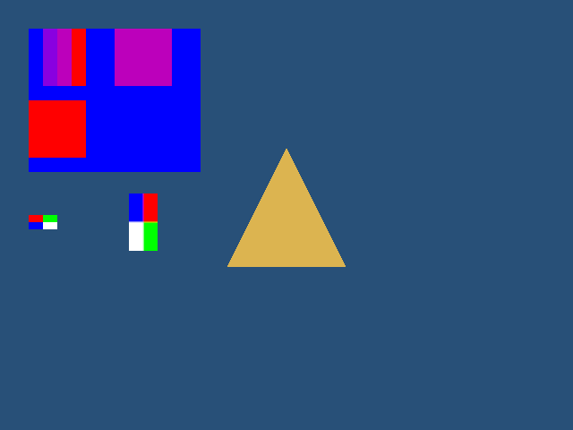
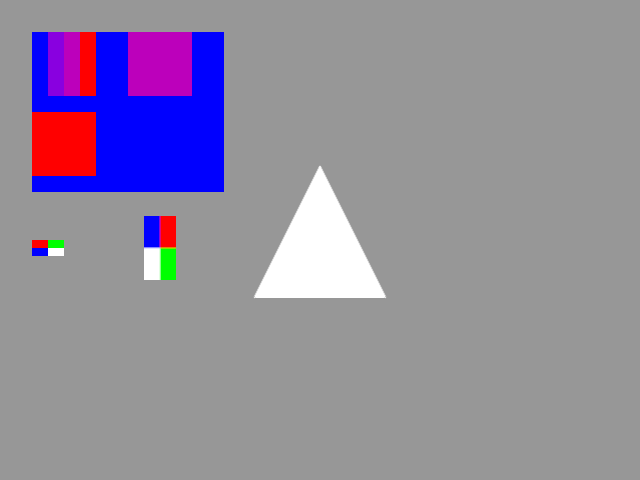

# 画像の読み込みと描画

gkcoreではPNGまたはBMPを`gk::LoadImage()`で読み込み、`gk::DrawImage()`か`gk::DrawImageRotated()`でフレームへ追加します。
描画命令を登録した後は、`gk::Present()`でそのフレームを表示します。

## 読み込みから表示まで

次の例では同じ画像をSceneとUIに描きます。
Sceneはポストエフェクトの対象になり、UIはエフェクト処理後に重ねられます。

```cpp
#include <gkcore.h>
#include <stdio.h>
/**
 * 失敗した操作と診断を出力する。
 */
bool Check(int result, const char* operation)
{
    if (result == 0)
    {
        return true;
    }
    fprintf(stderr, "%s: %s\n", operation, gk::GetLastErrorMessage());
    return false;
}
/**
 * 画像をSceneとUIに表示し、Escapeかウィンドウを閉じる操作で終了する。
 */
int main()
{
    if (!Check(gk::SetWindowSize(640, 480), "SetWindowSize"))
    {
        return 1;
    }
    if (!Check(gk::Init(), "Init"))
    {
        gk::Shutdown();
        return 1;
    }
    // ループ中に再利用する画像のhandle。
    const gk::ImageHandle image = gk::LoadImage("assets/icon.png");
    if (!image.IsValid())
    {
        fprintf(stderr, "LoadImage: %s\n", gk::GetLastErrorMessage());
        gk::Shutdown();
        return 1;
    }
    // 途中の失敗を終了コードへ反映する。
    bool succeeded = true;
    while (succeeded)
    {
        if (!gk::ProcessEvents())
        {
            // ウィンドウを閉じた場合の診断は空で、処理失敗時だけ原因が入る。
            const char* diagnostic = gk::GetLastErrorMessage();
            if (diagnostic[0] != '\0')
            {
                fprintf(stderr, "ProcessEvents: %s\n", diagnostic);
                succeeded = false;
            }
            break;
        }
        if (gk::IsKeyDown(gk::Key::Escape) || gk::WasKeyPressed(gk::Key::Escape))
        {
            break;
        }
        succeeded = Check(gk::BeginFrame(), "BeginFrame");
        if (succeeded)
        {
            succeeded = Check(gk::SetDrawLayer(gk::DrawLayer::Scene), "SetDrawLayer(Scene)");
        }
        if (succeeded)
        {
            succeeded = Check(gk::DrawImage(image, 32.0f, 32.0f, true), "DrawImage(Scene)");
        }
        if (succeeded)
        {
            succeeded = Check(gk::SetDrawLayer(gk::DrawLayer::UI), "SetDrawLayer(UI)");
        }
        if (succeeded)
        {
            succeeded = Check(gk::DrawImageRotated(image, 320.0f, 240.0f, 1.0f, 1.5707963f, true), "DrawImageRotated(UI)");
        }
        if (succeeded)
        {
            succeeded = Check(gk::Present(), "Present");
        }
    }
    succeeded = Check(gk::DeleteImage(image), "DeleteImage") && succeeded;
    gk::Shutdown();
    return succeeded ? 0 : 1;
}
```

`gk::DrawImage()`の座標は画像の左上です。
最後の引数`alphaBlend`を`true`にすると、PNGのalpha値を使って背景と合成します。
`false`ではalpha値を使わず、画像のRGBを描きます。
省略時は`true`です。

`gk::DrawImageRotated()`では、最初の2つの座標が画像の中心、`scale`が幅と高さに共通する拡大率、`angleRadians`が回転角です。
角度はradianで、画面のY座標が下向きに増えるため、正の角度は時計回りです。
たとえば`1.5707963f`はおよそ90度です。
`scale`は正の有限値を指定してください。

## 画像の寿命

`DrawImage()`または`DrawImageRotated()`が成功すると、その描画命令は画像データを保持します。
命令を登録した後に`gk::DeleteImage()`を呼んでも、登録済みの描画は`Present()`まで画像を使えます。
削除したhandleは無効になり、新たな描画命令には使えません。
読み直す場合は`LoadImage()`で新しいhandleを取得します。



基準画像では、赤いstripeを不透明な青いUI背景へ重ねています。
alpha 0、64、128、255のpixelは、それぞれRGB `(0, 0, 255)`、`(137, 0, 224)`、`(188, 0, 187)`、`(255, 0, 0)`になりました。
alpha 128の1×1画像を64×64へ拡大して重ねた中心pixelも`(188, 0, 187)`でした。
`alphaBlend=false`では、alpha 0のpixelも赤く描かれました。

四隅が赤・緑・青・白の画像は、通常描画では左上から赤・緑、左下から青・白でした。
正の90度回転後は、画面上の左上から青・赤、左下から白・緑になりました。



Sceneの背景色は基準設定のRGB `(40, 80, 120)`から、Scene効果を有効にした設定でRGB `(151, 151, 151)`へ変化しました。
Sceneはポストエフェクト後にUIより先に合成され、UIはScene効果の影響を受けません。

1フレームに3枚ずつ読み込み、描画を登録してからhandleを削除する処理を132フレーム続けました。
396個の新しい画像payloadを読み込み、cache entry数128を超えた後の130・131フレームでもUI画像が正しく表示されました。

対応する全画像形式、全alpha値、GPU処理性能、異常終了時の資源解放、デバイス喪失時の復旧は検証していません。
