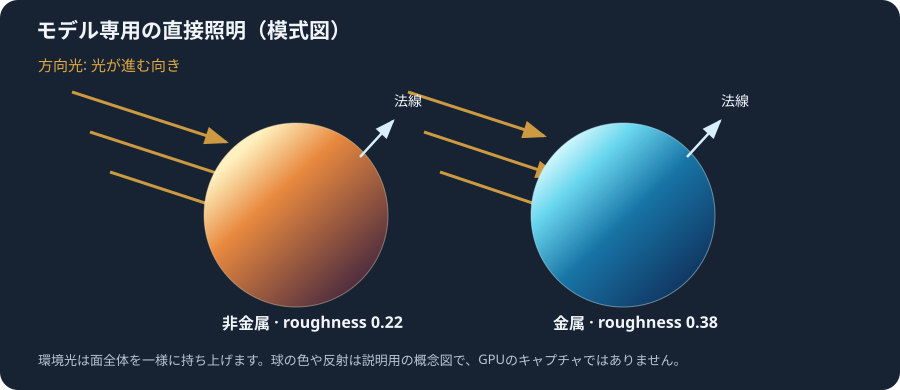

# モデルに光を当てる

`gk::DrawModel` は GLB の静的メッシュに含まれる法線と PBR 基本色を使って描画します。次の例には、同じ形の球が 2 個あります。左は非金属で滑らかな材質、右は金属で少し粗い材質です。方向光を動かし、面の明るさや材質の反射の違いを見比べます。



## 例を起動する

開発用 build で `gkcore_model_lighting` を起動します。実行ファイルと同じフォルダーにある `model_lighting.glb` を読み込みます。PowerShell ではそのフォルダーを作業ディレクトリにして起動します。

```powershell
cd build\runtime-windows\Release
.\gkcore_model_lighting.exe
```

ウィンドウで次のキーを使います。

| キー | 動作 |
|---|---|
| 左 / 右 | 方向光を左右へ回す |
| Space | 方向光を約 90 度切り替える |
| Escape | 終了する |

球の明るい側から暗い側へ目を動かすと、法線が向く方向によって明るさが変わる様子を確認できます。金属球と非金属球は、金属度と粗さが異なるため、同じ方向光でもハイライトの色や広がりが違います。

この GLB はサンプル用に生成した小さな球のメッシュです。各頂点に位置・法線・UV を含み、材質の base color、metallic、roughness をモデルファイル内に保持します。実物のモデルでも同じ `gk::LoadModel` / `gk::DrawModel` の手順を使います。

## 照明を設定する

```cpp
gk::SetAmbientLight(0.2f);
gk::SetDirectionalLight(gk::Vec3{0.4f, -0.8f, 0.4f}, 3.0f);
```

`SetAmbientLight` は一様な環境光の強さを設定します。範囲は `0.0f` から `4.0f`、初期値は `0.2f` です。環境マップを使う設定ではありません。

`SetDirectionalLight` の `direction` は、光がワールド空間を進む向きです。たとえば `{1, 0, 0}` は光が +X 方向へ進むことを表し、面を照らす向きはその反対になります。方向は有限な 0 以外のベクトルを渡し、内部で正規化されます。`intensity` は有限な `0.0f` から `16.0f` までで、省略時は `3.0f` です。

設定は `BeginFrame()` を呼んだ時点でそのフレームに取り込まれます。フレームごとに光を動かす場合は、`BeginFrame()` より前に照明関数を呼びます。無効な値を渡した関数は失敗し、`gk::GetLastErrorMessage()` で理由を確認できます。照明設定は `Shutdown()` で初期値に戻ります。

## 対応する材質と制限

モデル専用の組み込み材質 shader は、法線を使う Lambert 拡散反射と、metallic / roughness に基づく direct-light GGX、Fresnel、Smith の鏡面反射を計算します。GLB の base-color factor と base-color texture、metallic factor、roughness factor を読み取ります。欠けた法線は三角形の面法線から補います。退化した面で法線も欠けている場合は有限な補完法線を使います。非一様なモデル scale でも法線を正しく変換します。

2D の図形・画像・文字と、公開カスタム pixel shader は照明されず従来どおり描画します。`DrawModel` のモデルは選択中の描画層に従い、UI 層に置いたモデルも材質照明を受けます。モデル材質用の公開 shader ABI はまだありません。

影、環境マップ / image-based lighting、metallic-roughness texture、normal map、alpha mode の切り替えは未対応です。Windows/MSVC Runtime Release build/link、COM reflection、および RTX 4070 SUPER での GPU smoke は確認済みです。smoke は照明設定を変更した後、model-only の Scene/UI 描画 API と Present が成功することを確認します。画素の読み戻しや照明の見た目・品質は検証していません。

詳細な現在の確認範囲は [機能サポート状況](ROADMAP.md) を参照してください。
