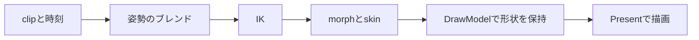
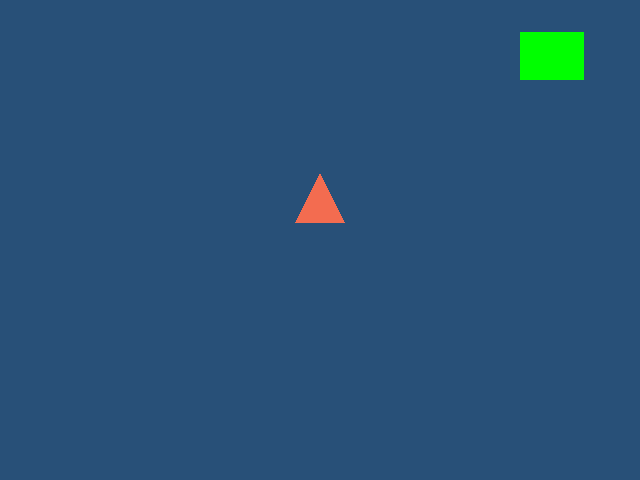
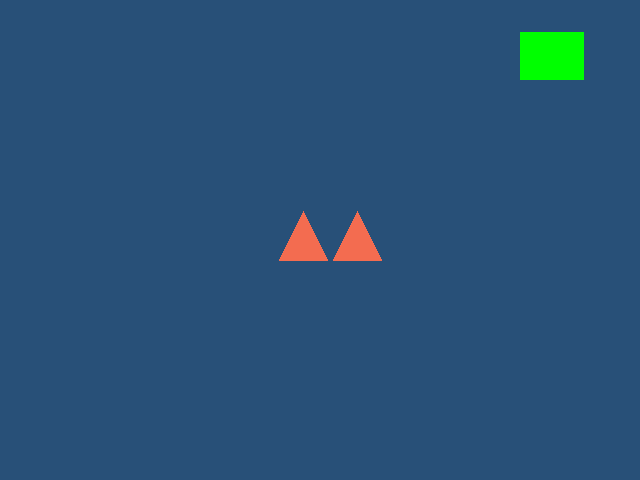

# モデルアニメーション

GLBとFBXはファイル内のclip、OBJは同じ頂点・面順序の連番ファイルを再生します。位置・回転・大きさの設定と`DrawModel`は静的モデルと共通です。

確認済みのアニメーション経路は、GLB/FBX内clip、対応する連番OBJ、外部GLB/FBX motion、clip blend、2ボーンおよびchain IKです。入力条件と未対応形式は後述の制約を確認してください。実モデルでの対応結果は下記のYUMEKA/Mixamo例に限られ、全モデルの見た目や画質を保証しません。

## 再生と時刻

`LoadModel`で読み込み、`GetModelAnimationCount`・`GetModelAnimationName`でclipを選びます。`PlayModelAnimation`は時刻0から再生します。経過秒はアプリから`UpdateModelAnimation`へ渡します。`BeginFrame`は再生時刻を進めません。

```cpp
const auto character = gk::LoadModel("character.glb");
gk::PlayModelAnimation(character, 0, true);
gk::UpdateModelAnimation(character, deltaSeconds);
gk::DrawModel(character);
```

`SetModelAnimationTime`で秒単位の時刻を指定できます。速度は`SetModelAnimationSpeed`で変更し、0で一時停止、負値で逆再生します。loop中はclip長で折り返し、loopなしでは両端へ制限します。`StopModelAnimation`は再生枠を解除して初期姿勢へ戻します。

`CreateModelInstance`は形状・材質を共有し、新しい位置設定と独立した再生状態を持つモデルを作ります。読み込み直後はclipを再生せず、初期姿勢と既定morph係数を表示します。

`DrawModel`は呼び出した時点の変形結果を保持します。同じframe中で時刻、ブレンド、IKを変えても先に予約した描画は変わりません。モデルや外部アニメーションのhandleを削除しても、予約済みの描画と適用済みのclipは必要なデータを保持します。

対応するWindows GPUではFBXの線形skinと法線生成をGPUで計算します。高精度の計算に非対応のGPU、morphなどGPU経路の対象外の姿勢、独自shaderではCPU経路を使います。GPU計算で位置が不正になったり、使われる面の法線が失われたりした場合は`Present()`が失敗し、`GetLastErrorMessage()`に理由を返します。`DrawModel()`と`Present()`の両方の戻り値を確認してください。

## 連番OBJ

```cpp
const char* frames[] = { "walk_000.obj", "walk_001.obj", "walk_002.obj" };
const auto character = gk::LoadModelSequence(frames, 3, 24.0f);
gk::PlayModelAnimation(character);
```

隣り合うframeの位置と法線を補間します。面、元の頂点番号、UVの順序は揃えてください。面の接続や頂点数を変えるファイルは読み込み時に拒否します。clipの長さは`(frameCount - 1) / fps`です。1frameも使え、その長さは0秒です。最大4096frame、全frameの頂点データ合計256 MiBまでです。OBJ自身にはボーンがないため、連番OBJへのボーンIKは使いません。

## 外部clipとボーン対応

`LoadModelAnimation`はGLB/FBXからclipと骨格を読み込み、meshがないファイルも扱います。`LoadModelSequenceAnimation`は連番OBJをアニメーションだけのデータとして読み込みます。外部clipの一覧は`GetAnimationClipCount`・`GetAnimationClipName`・`GetAnimationClipDuration`で取得します。

```cpp
const auto motion = gk::LoadModelAnimation("walk.fbx");
gk::ApplyModelAnimation(character, motion, 0, true);
gk::DeleteModelAnimation(motion);
```

ボーンは一意な名前で対応付けます。異なる名前の人型モデルは、適用前に`SetModelBoneRole`と`SetAnimationBoneRole`で腰・背骨・手足・指などの役割を設定します。ボーンの番号や名前は`GetModelBoneCount`・`GetModelBoneName`・`FindModelBone`、外部データ側は`GetAnimationBoneCount`・`GetAnimationBoneName`で調べられます。

一般的な英語・日本語の骨名は`AutoMapModelHumanoidBones`と`AutoMapAnimationHumanoidBones`で役割を推定できます。成功は0、認識できる骨がない場合や名前が曖昧な場合は-1です。手動で割り当てた役割は優先され、推定は未設定の骨を補います。`GetModelBoneRole`と`GetAnimationBoneRole`で結果を確認し、適用後は`GetModelAnimationSourceBone`で適用先の各骨に対応したsource番号を調べられます。自動対応は未知の骨名や曖昧な構造を必ず解決するものではありません。対応しない骨や役割は初期姿勢のままなので、必要に応じて手動設定してください。

```cpp
gk::SetModelBoneRole(character, targetHips, gk::EHumanoidBone::Hips);
gk::SetAnimationBoneRole(motion, sourceHips, gk::EHumanoidBone::Hips);
gk::ApplyModelAnimation(character, motion);
```

役割はモデルごとに一意に割り当てます。回転は初期姿勢に対するモデル空間の差分を適用先へ移し、親の向きとscaleを含めて位置差分を変換します。役割で対応した手足の位置は適用先の骨長を保ち、腰の移動は初期の高さ比に合わせます。名前で対応したボーンは位置のアニメーションも転送します。morphは一意な名前で対応付け、未対応のボーン・morphは適用先の初期値を保ちます。対応するものがないデータや曖昧な名前は診断付きで拒否します。

対応表はclipの適用時に確定します。役割を変更した後は再度`ApplyModelAnimation`を呼んでください。異なる体型でも、初期姿勢と役割の設定が適切であることが前提です。

実モデルでは、317骨のYUMEKA FBXへMixamoの`Silly Dancing.fbx`と`Capoeira.fbx`を外部clipとして適用する確認を行いました。両motionは66骨で、名前から役割が推定された骨はYUMEKA側53、motion側48、共通して対応した骨は47です。未対応の役割は初期姿勢のまま残るため、必要なら手動で補います。この結果は該当モデル・motionでの確認であり、任意の人型骨格への完全自動retargetや画質改善を保証しません。調達したCesium Man GLBはローカル検証専用です。元モデルとライセンス情報は[Khronos glTF Sample AssetsのCesiumMan](https://github.com/KhronosGroup/glTF-Sample-Assets/tree/edc7c9e67c639d230715049ee31f9a96a6babbbe/Models/CesiumMan)にあり、CC-BY-4.0とCesiumのLegalMark条件が付くため、SDKや配布物には含めません。ユーザー提供のモデルやmotionも、権利確認なしに再配布しないでください。

`SetModelMaterial`と`FModelMaterialSettings`ではモデル材質の基本色、基本色画像、alpha mode、cutoffを変更できます。材質は複製して更新されるため、同じ形状を使う別instanceや、すでに`DrawModel`で予約した描画の材質は変わりません。`generateMipmaps`は既定でtrueとなり、基本色画像の縮小表示にmip chainを使います。既定alpha modeはOPAQUEで、基本色画像のalphaは無視します。これは任意の元シェーダーやtoon材質を再現する機能ではありません。

## ブレンド

主clipと2番目のclipを、別々の時刻・速度・loopで再生します。位置・scale・morph係数は線形補間、回転はquaternionの短い経路で補間します。

```cpp
gk::PlayModelAnimation(character, idleClip);
gk::SetModelAnimationBlend(character, walkClip, 0.5f);
gk::SetModelAnimationTime(character, 0.4, 0);
gk::SetModelAnimationTime(character, 0.7, 1);
gk::SetModelAnimationBlendWeight(character, 0.8f);
```

係数0は主clip、1は2番目のclipです。外部データを渡す`SetModelAnimationBlend`もあります。clipを変えずに係数だけ動かすときは`SetModelAnimationBlendWeight`を使います。OBJ連番同士は対応する頂点の位置・法線をブレンドします。連番OBJとボーンclipは混ぜません。

## IK

IKはclipの評価とブレンドの後、skinの変形前に適用します。targetとpoleはモデル空間の位置です。モデルの表示位置・回転・scaleを設定する前の座標を渡してください。



```cpp
gk::SetModelTwoBoneIk(character, upperArm, lowerArm, hand, target, elbowPole, 1.0f);
const uint32_t chain[] = { shoulder, upperArm, lowerArm, hand };
gk::SetModelIkChain(character, chain, 4, target, 1.0f);
```

2ボーンは肘・膝などの曲げ方向をpoleで指定します。poleと目標方向が重なる場合は、現在の曲がり方か一定の軸で方向を決めます。汎用chainは親子が連続したボーン列をFABRIKで解きます。骨長を保ち、届かない目標は届く範囲へ近づけます。weightは0から1で、0なら元の姿勢を保ちます。

同じrootへの設定は上書きし、異なるrootの設定は登録順に適用します。`ClearModelIk`ですべて解除します。ゼロ長の骨、循環・途切れた階層、非有限値、固定された形式上の補助変換は拒否します。IK対象と祖先のscaleは正の均一倍率が必要です。



検査用の三角形をendボーンへ結び、2ボーンIKで目標位置へ動かした画像です。計算から作った静的参照と全画素が一致しました。右上の緑は独立したUI描画です。



2つの描画の間でclip時刻を変更し、model handleをPresent前に削除しています。先に予約した姿勢も保持されます。

## 読み込みの範囲

GLBはnodeのTRS、skin、morph、STEP・LINEAR・CUBICSPLINEのclipに対応します。skinは1頂点4weightの`JOINTS_0`・`WEIGHTS_0`を使い、inverse bind matrixの省略は単位行列として扱います。追加weightセット、animation/morphのsparse accessor、shearを持つアニメーションnodeの行列は診断付きで拒否します。固定cgltfの制約により、同じmesh内でmorph targetの有無・個数がprimitiveごとに異なる構成も未対応です。静的なshear行列の表示は従来どおりです。

FBXは固定ufbxのclip評価、skin、blend shapeを使います。右手系のY-up、メートルへ揃え、変換・単位・scale継承の補助情報を保持します。geometry cacheと、同じskin meshを複数nodeが使う入力は未対応です。固定された暗黙rootはIKで回転できません。

材質・UV・画像の読み込み条件は[モデルガイド](models.md)と共通です。アニメーションのブレンドと、透明材質の`alphaMode=BLEND`は別の機能です。GLBのalpha合成とsort範囲は[GLBの透明部分](models.md#glb-の透明部分)を参照してください。

法線・接線を生成するmorphは、初期形状と各targetの形状から別々に計算し、差分へ係数を掛けます。最終位置だけから法線を計算する方式とは中間の係数で結果が異なります。[glTF 2.0のmorph処理](https://github.com/KhronosGroup/glTF/blob/main/specification/2.0/Specification.adoc#applying-morph-data)に合わせて検査しています。
