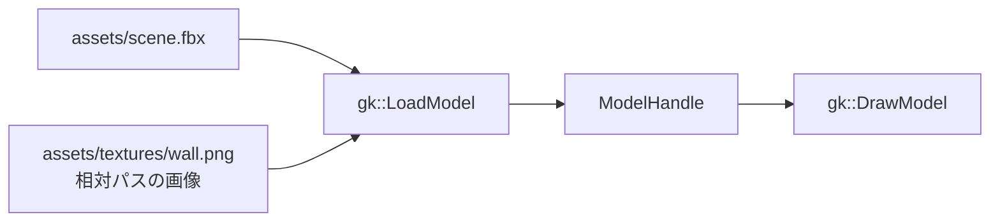

# モデルを読み込む

`gk::LoadModel` に UTF-8 のファイルパスを渡すと、静的モデルのハンドルが返ります。OBJ、GLB 2.0、FBX を読み込めます。読み込んだモデルは位置・回転・大きさを設定して `gk::DrawModel` で描画し、使い終えたら `gk::DeleteModel` で解放します。読み込みに失敗すると無効なハンドルが返るため、`gk::GetLastErrorMessage()` で理由を確認してください。

```cpp
#include <gkcore.h>
#include <stdio.h>

/**
 * API失敗を操作名と診断付きで出力する。
 */
bool Check(int result, const char* operation)
{
    if (result == 0)
    {
        return true;
    }
    fprintf(stderr, "%s: %s\n", operation, gk::GetLastErrorMessage());
    return false;
}

/**
 * モデルを読み込み、終了要求またはエラーまで描画する。
 */
int main()
{
    if (!Check(gk::SetWindowSize(1280, 720), "SetWindowSize") || !Check(gk::Init(), "Init"))
    {
        gk::Shutdown();
        return 1;
    }

    // 読み込んだモデルのハンドル。
    const gk::ModelHandle scene = gk::LoadModel("assets/scene.glb");
    if (!scene.IsValid())
    {
        fprintf(stderr, "LoadModel: %s\n", gk::GetLastErrorMessage());
        gk::Shutdown();
        return 1;
    }

    // 後続の描画へ適用するカメラとモデル変換。
    bool failed = !Check(gk::SetCamera(gk::Vec3{ 0.0f, 0.0f, -5.0f }, gk::Vec3{ 0.0f, 0.0f, 0.0f }), "SetCamera") || !Check(gk::SetModelPosition(scene, gk::Vec3{ 0.0f, 0.0f, 0.0f }), "SetModelPosition") || !Check(gk::SetModelRotation(scene, gk::Vec3{ 0.0f, 0.0f, 0.0f }), "SetModelRotation") || !Check(gk::SetModelScale(scene, gk::Vec3{ 1.0f, 1.0f, 1.0f }), "SetModelScale");
    while (!failed)
    {
        if (!gk::ProcessEvents())
        {
            // 終了要求は診断が空で、イベント処理の失敗時は診断が入る。
            const char* diagnostic = gk::GetLastErrorMessage();
            if (diagnostic && diagnostic[0])
            {
                fprintf(stderr, "ProcessEvents: %s\n", diagnostic);
                failed = true;
            }
            break;
        }
        if (gk::IsKeyDown(gk::Key::Escape) || gk::WasKeyPressed(gk::Key::Escape))
        {
            break;
        }
        if (!Check(gk::BeginFrame(), "BeginFrame") || !Check(gk::SetDrawLayer(gk::DrawLayer::Scene), "SetDrawLayer(Scene)") || !Check(gk::DrawModel(scene), "DrawModel") || !Check(gk::Present(), "Present"))
        {
            failed = true;
        }
    }

    failed = !Check(gk::DeleteModel(scene), "DeleteModel") || failed;
    gk::Shutdown();
    return failed ? 1 : 0;
}
```

`gk::SetModelPosition`、`gk::SetModelRotation`、`gk::SetModelScale` は後続の `DrawModel` に使う変換を設定し、それぞれ失敗時にエラーを返します。`ProcessEvents()` が `false` の場合は `GetLastErrorMessage()` を確認し、診断が空ならウィンドウ終了、文字列があればイベント処理の失敗として扱います。Escape は押した瞬間と押し続けている状態のどちらでも終了できます。

## GLB の画像と UV

GLB 2.0 の `baseColorTexture` は、`texCoord` が示す `TEXCOORD_n` の UV（画像上のどこを読むかを示す座標）で画像を参照します。`texCoord` を省略した場合は `TEXCOORD_0`、明示した場合は指定番号のUVセットを使います。たとえば `texCoord: 1` は `TEXCOORD_1` を選びます。詳細は [glTF 2.0仕様の Texture Info](https://registry.khronos.org/glTF/specs/2.0/glTF-2.0.html#_textureinfo_texcoord) を参照してください。

`texCoord` の省略と明示値0、1、2、および normalized U16 / U8 のUV1を使う6種類のGLBを、Release・Debug構成でGPU画像検査しました。UV0とUV1で模様の左右が切り替わることを確認しています。サポート対象の座標がモデルにない場合、負の番号、対応しない成分型、位置とUVの頂点数不一致は読み込み時に診断付きで拒否します。座標の成分は32bitの浮動小数、または0から1へ正規化する符号なし8bit・16bit整数を使えます。UV sparse accessor（座標の一部だけを差分として格納する形式）と、画像に追加の座標変換を加える `KHR_texture_transform` は未対応です。仕様の拡張内容は [KHR_texture_transform](https://github.com/KhronosGroup/glTF/blob/main/extensions/2.0/Khronos/KHR_texture_transform/README.md) を参照してください。


UV0では、画像の赤・緑・青・白の四隅がモデルの各頂点側にそのまま現れます。


UV1では左右が反転し、指定されたUVセットが切り替わったことを確認できます。GPU検査の設定と実行範囲は[描画検証](render-validation.md)を参照してください。

GLBの画像は埋め込みPNGに対応します。外部画像、UV sparse、`KHR_texture_transform`は未対応です。GLBの画像のRGBはsRGB、材質の基本色係数は線形値として扱います。画像は端の色で固定して描き、samplerの繰り返し・鏡映指定は反映しません。

## GLB の透明部分

glTFの `alphaMode` を省略した場合と `OPAQUE` では、画像のalphaと材質のalpha係数を無視して不透明に描きます。`MASK` では、画像のalphaに材質の基本色alpha係数を掛けた値を判定します。`alphaCutoff` を省略すると `0.5` です。判定値がcutoff未満の画素だけを描かず、cutoffと等しい画素は残します。cutoff `0` ではalpha値に関係なくすべて残り、`1`を超える有限値ではすべて抜けます。画像がない材質でも、材質alpha係数で同じ判定をします。切り抜きの判定にalphaを使いますが、残った画素のRGBをalphaで暗くしません。

SceneとUIの内蔵モデルshaderでMASKを処理します。抜いた画素はcolorだけでなくdepthも更新しないため、奥に描いた形状がその部分から見えます。次の画像はopaque描画、MASKによる切り抜き、背面モデルでdepthの状態を確かめたGPU画像です。


GPU検査ではScene 11画像、UI 4画像、depth検査1画像を確認しました。有限なcutoff `2` と、負または非有限なcutoffの読み込み拒否も確認しています。`BLEND` は `LoadModel` 時に診断付きで拒否します。MASKモデルを描くときに `gk::SetPixelShader` で独自pixel shaderを選んでいると、alpha情報を独自shaderへ渡すABIがないため `Present` が診断付きで拒否されます。内蔵shaderへ戻すには `gk::SetPixelShader({})` を呼んでください。ここで説明した検査は標準の `OPAQUE` と `MASK` を対象としており、glTF JSON全体のschema検証を保証するものではありません。alpha modeの仕様は[glTF 2.0仕様のAlpha Coverage](https://registry.khronos.org/glTF/specs/2.0/glTF-2.0.html#alpha-coverage)を参照してください。

Windows 11 Pro、RTX 4070 SUPER / driver 610.74、Visual Studio 2026 / v142、Windows SDK 10.0.22621.0でDebug・Releaseの全41テストが成功し、16画像は構成間でもbyte単位に一致しました。再検査は次で実行します。

```bat
ctest --test-dir build/runtime-windows -C Release -R gkcore.model_alpha --output-on-failure
ctest --test-dir build/runtime-windows-debug -C Debug -R gkcore.model_alpha --output-on-failure
```

## ファイルの置き方

```text
assets/
├── scene.fbx       # LoadModel へ渡すモデル
└── textures/
    ├── wall.png     # 相対パスで参照する画像
```

FBX が外部画像を参照するときは、FBX ファイルの場所を基準にした相対パスで読み込みます。絶対パスは拒否されます。モデルと画像をまとめて移動できるよう、関連ファイルは同じ `assets` フォルダーに置いてください。

FBX モデルと相対パスの画像が読み込みから描画へ進む流れです。



## FBX の対応範囲

FBX は ASCII 形式とバイナリ形式の静的メッシュを読み込めます。外部画像はFBXファイルの場所を基準にした相対パスで参照します。絶対パスは拒否されます。外部PNGと埋め込みPNGの取り込みをCPUテストで確認しています。FBXのUVは先頭のUVセットを使い、V座標を反転して画像の左上原点に合わせます。FBXのBMP読み込みは未確認です。

FBXのモデルは右手系のY-up、メートル単位へそろえ、階層変換とメッシュの幾何変換を反映します。材質のRGB係数は線形値、画像のRGBはsRGBとして扱います。画像は端の色で固定し、繰り返し・鏡映やUV変換は反映しません。透明度係数はアルファ値に保持しますが、アルファ合成方式の切り替えは未対応です。

モデルの材質では基本色係数とGLBのmetallic / roughness係数を使います。OBJとFBXはmetallic `0`、roughness `1` で描画します。方向光と一様な環境光による材質照明を設定できます。使い方は[モデル照明ガイド](lighting.md)を参照してください。

影、環境マップ / IBL、metallic-roughness texture、normal map、`BLEND`、アニメーション、スキニング、モーフターゲット、レイヤー合成、手続き的に生成する画像は未対応です。対応状況は[機能一覧](ROADMAP.md)、GPU画像を含む検証結果は[描画検証](render-validation.md)を参照してください。
