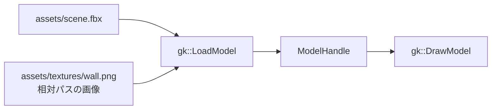

# モデルを読み込む

`gk::LoadModel` にファイルの場所を渡すと、モデルハンドルが返ります。OBJ、GLB 2.0、FBX の静的メッシュを読み込めます。位置・回転・大きさを設定し、`gk::DrawModel` で描画します。FBX の読み込みと材質・画像の取り込みは CPU テストで確認しています。Windows/MSVC でのリンクと実 GPU 上の表示は未確認です。

```cpp
#include <stdio.h>
#include <gkcore.h>

int main() {
    if (gk::SetWindowSize(1280, 720) != 0 || gk::Init() != 0) return 1;

    const gk::ModelHandle scene = gk::LoadModel("assets/scene.fbx");
    if (!scene.IsValid()) {
        fprintf(stderr, "%s\n", gk::GetLastErrorMessage());
        gk::Shutdown();
        return 1;
    }

    gk::SetModelPosition(scene, gk::Vec3{0.0f, 0.0f, 0.0f});
    gk::SetModelRotation(scene, gk::Vec3{0.0f, 0.0f, 0.0f});
    gk::SetModelScale(scene, gk::Vec3{1.0f, 1.0f, 1.0f});
    bool failed = false;
    while (gk::ProcessEvents() && !gk::IsKeyDown(gk::Key::Escape)) {
        if (gk::BeginFrame() != 0 ||
            gk::SetDrawLayer(gk::DrawLayer::Scene) != 0 ||
            gk::DrawModel(scene) != 0 ||
            gk::Present() != 0) {
            failed = true;
            break;
        }
    }

    gk::DeleteModel(scene);
    gk::Shutdown();
    return failed ? 1 : 0;
}
```

読み込みに失敗すると無効なハンドルが返ります。`gk::GetLastErrorMessage()` で理由を確認してください。使い終わったモデルは `gk::DeleteModel(scene)` で解放します。カメラの設定とフレーム内の描画順は[クイックスタート](quickstart.md)を参照してください。

## ファイルの置き方

```text
assets/
├── scene.fbx       # LoadModel へ渡すモデル
└── textures/
    ├── wall.png     # 相対パスで参照する画像
```

FBX が外部画像を参照するときは、FBX ファイルの場所を基準にした相対パスで読み込みます。絶対パスは拒否されます。モデルと画像をまとめて移動できるよう、関連ファイルは同じ `assets` フォルダーに置いてください。

FBX モデルと相対パスの画像が読み込みから描画へ進む流れです。



## FBX の対応範囲

FBX は ASCII 形式とバイナリ形式の両方に対応します。`.fbx` も OBJ / GLB と同じ `gk::LoadModel("assets/scene.fbx")` で読み込みます。対象は静的メッシュと基本色係数・画像です。外部 PNG と埋め込み PNG の取り込みを確認しています。FBX での BMP 読み込みはまだ確認していません。

読み込んだモデルは右手系の Y-up、メートル単位になります。FBX の階層変換とメッシュの幾何変換を反映し、センチメートル単位のモデルも変換します。UV は先頭の UV セットを使い、V 座標を反転して画像の左上原点に合わせます。UV 変換を含む画像設定には対応しません。RGB 材質係数は線形値として扱い、画像の RGB は sRGB として読み込みます。画像は端の色で固定して描画します。繰り返し・鏡映の指定は反映しません。透明度係数はアルファ値へ反映しますが、アルファ合成方式の切り替えには対応しません。

アニメーション、スキニング、モーフターゲット、レイヤー合成や手続き的に生成する画像、UV 変換は対象外です。PBR 照明、影、環境マップ、アルファ合成方式の切り替えも未対応です。FBX の CPU 読み込みは確認済みですが、Windows/MSVC でのリンクと実 GPU 上の表示は未確認です。形式ごとの最新状態は[機能一覧](ROADMAP.md)を参照してください。
