# モデルを読み込む

`gk::LoadModel` に UTF-8 のファイルパスを渡すと、静的モデルのハンドルが返ります。OBJ、GLB 2.0、FBX を読み込めます。読み込んだモデルは位置・回転・大きさを設定して `gk::DrawModel` で描画し、使い終えたら `gk::DeleteModel` で解放します。読み込みに失敗すると無効なハンドルが返るため、`gk::GetLastErrorMessage()` で理由を確認してください。

```cpp
#include <gkcore.h>
#include <stdio.h>

/**
 * API失敗を操作名と診断付きで出力する。
 */
bool Check(int result, const char* operation)
{
    if (result == 0)
    {
        return true;
    }
    fprintf(stderr, "%s: %s\n", operation, gk::GetLastErrorMessage());
    return false;
}

/**
 * モデルを読み込み、終了要求またはエラーまで描画する。
 */
int main()
{
    if (!Check(gk::SetWindowSize(1280, 720), "SetWindowSize") || !Check(gk::Init(), "Init"))
    {
        gk::Shutdown();
        return 1;
    }

    // 読み込んだモデルのハンドル。
    const gk::ModelHandle scene = gk::LoadModel("assets/scene.glb");
    if (!scene.IsValid())
    {
        fprintf(stderr, "LoadModel: %s\n", gk::GetLastErrorMessage());
        gk::Shutdown();
        return 1;
    }

    // 後続の描画へ適用するカメラとモデル変換。
    bool failed = !Check(gk::SetCamera(gk::Vec3{ 0.0f, 0.0f, -5.0f }, gk::Vec3{ 0.0f, 0.0f, 0.0f }), "SetCamera") || !Check(gk::SetModelPosition(scene, gk::Vec3{ 0.0f, 0.0f, 0.0f }), "SetModelPosition") || !Check(gk::SetModelRotation(scene, gk::Vec3{ 0.0f, 0.0f, 0.0f }), "SetModelRotation") || !Check(gk::SetModelScale(scene, gk::Vec3{ 1.0f, 1.0f, 1.0f }), "SetModelScale");
    while (!failed)
    {
        if (!gk::ProcessEvents())
        {
            // 終了要求は診断が空で、イベント処理の失敗時は診断が入る。
            const char* diagnostic = gk::GetLastErrorMessage();
            if (diagnostic && diagnostic[0])
            {
                fprintf(stderr, "ProcessEvents: %s\n", diagnostic);
                failed = true;
            }
            break;
        }
        if (gk::IsKeyDown(gk::Key::Escape) || gk::WasKeyPressed(gk::Key::Escape))
        {
            break;
        }
        if (!Check(gk::BeginFrame(), "BeginFrame") || !Check(gk::SetDrawLayer(gk::DrawLayer::Scene), "SetDrawLayer(Scene)") || !Check(gk::DrawModel(scene), "DrawModel") || !Check(gk::Present(), "Present"))
        {
            failed = true;
        }
    }

    failed = !Check(gk::DeleteModel(scene), "DeleteModel") || failed;
    gk::Shutdown();
    return failed ? 1 : 0;
}
```

`gk::SetModelPosition`、`gk::SetModelRotation`、`gk::SetModelScale` は後続の `DrawModel` に使う変換を設定し、それぞれ失敗時にエラーを返します。`ProcessEvents()` が `false` の場合は `GetLastErrorMessage()` を確認し、診断が空ならウィンドウ終了、文字列があればイベント処理の失敗として扱います。Escape は押した瞬間と押し続けている状態のどちらでも終了できます。

## GLB の画像と UV

GLB 2.0 の `baseColorTexture` は、`texCoord` が示す `TEXCOORD_n` の UV（画像上のどこを読むかを示す座標）で画像を参照します。`texCoord` を省略した場合は `TEXCOORD_0`、明示した場合は指定番号のUVセットを使います。たとえば `texCoord: 1` は `TEXCOORD_1` を選びます。詳細は [glTF 2.0仕様の Texture Info](https://registry.khronos.org/glTF/specs/2.0/glTF-2.0.html#_textureinfo_texcoord) を参照してください。

`baseColorTexture`、`metallicRoughnessTexture`、`normalTexture` はそれぞれ独立して `texCoord` を選べます。UV座標の対応形式と、sparse accessor・`KHR_texture_transform` の制約は3種類に共通です。

`texCoord` の省略と明示値0、1、2、および normalized U16 / U8 のUV1を使う6種類のGLBを、Release・Debug構成でGPU画像検査しました。UV0とUV1で模様の左右が切り替わることを確認しています。サポート対象の座標がモデルにない場合、負の番号、対応しない成分型、位置とUVの頂点数不一致は読み込み時に診断付きで拒否します。座標の成分は32bitの浮動小数、または0から1へ正規化する符号なし8bit・16bit整数を使えます。UV sparse accessor（座標の一部だけを差分として格納する形式）と、画像に追加の座標変換を加える `KHR_texture_transform` は未対応です。仕様の拡張内容は [KHR_texture_transform](https://github.com/KhronosGroup/glTF/blob/main/extensions/2.0/Khronos/KHR_texture_transform/README.md) を参照してください。

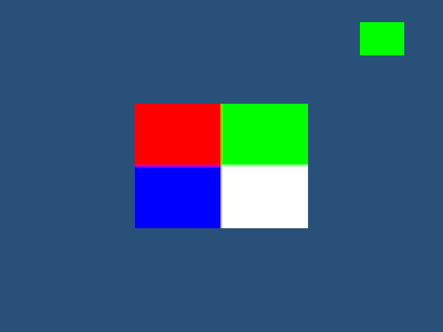

UV0では、画像の赤・緑・青・白の四隅がモデルの各頂点側にそのまま現れます。

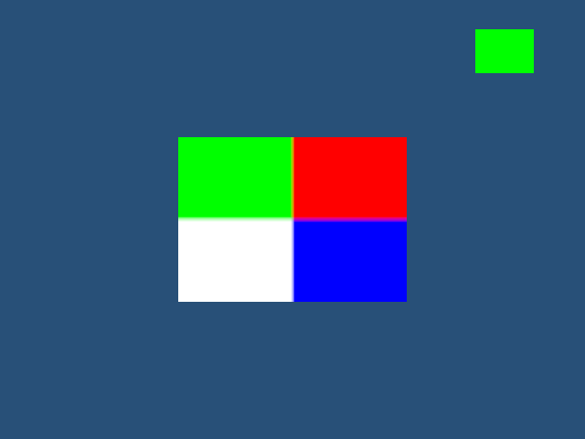

UV1では左右が反転し、指定されたUVセットが切り替わったことを確認できます。GPU検査の設定と実行範囲は[描画検証](render-validation.md)を参照してください。

GLBの画像は埋め込みPNGに対応します。外部画像、UV sparse、`KHR_texture_transform`は未対応です。GLBの基本色画像のRGBはsRGB、材質係数・MR画像・法線画像は線形値として扱います。標準のモデル描画では、textureごとのsamplerで繰り返し・鏡映・端で固定する指定を反映します。

## GLB の metallic-roughness 画像

GLBの `metallicRoughnessTexture` は、Gチャンネルから粗さ、Bチャンネルから金属度を読みます。これらの値は線形値として扱い、それぞれ材質の `roughnessFactor` と `metallicFactor` を掛けて使います。RとAは使いません。画像が指定されていない場合はGとBがともに1の白い値を使い、材質係数だけで調整します。基本色画像のRGBはsRGBとして読み、metallic-roughness画像は線形データとして扱うため、同じPNGを両方の役割に指定した場合も読み取り時の色変換は役割ごとに異なります。両方の画像は埋め込みPNGに対応します。

基本色画像とmetallic-roughness画像のUV選択は独立しています。たとえば基本色は `TEXCOORD_0`、metallic-roughnessは `TEXCOORD_1` を使えます。未指定時はそれぞれ `TEXCOORD_0` が選ばれます。対応するUVがない場合や、未対応の成分形式・座標変換が指定された場合は読み込み時に診断します。


参照画像はmetallic / roughness係数を設定したモデルです。GPU検査ではshader式をテスト側で再現せず、画像テクスチャを使うモデルと同じ係数の参照モデルを比較しました。

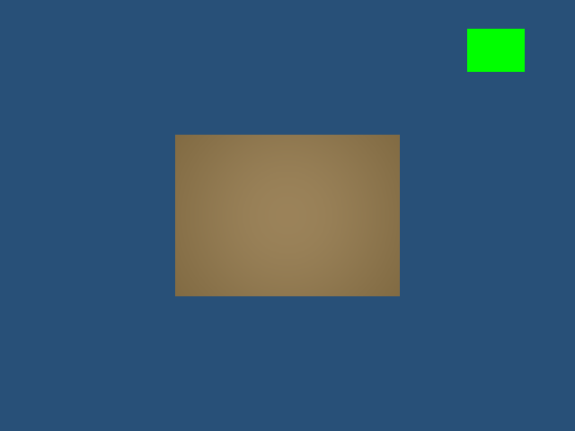

画像のG/B値と材質係数の組み合わせが、同じ値を係数で指定した参照モデルと一致することを確認しました。R/Aを変えた画像、係数を掛けた画像、基本色にも同じPNGを使う例、基本色画像なしの例、MASK材質でalphaが0のmetallic-roughness画像も含みます。

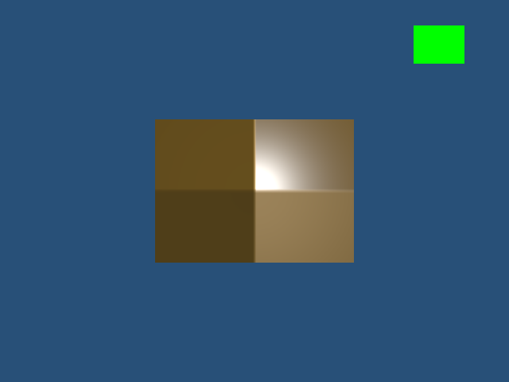

この例では基本色を `TEXCOORD_0`、metallic-roughness画像を `TEXCOORD_1` から読みます。UV1の領域ごとに異なる金属度・粗さを参照画像と比較しました。

MR材質はScene/UIのモデル描画に使う内蔵lighting shaderで処理します。独自pixel shaderを選ぶ公開APIは変更していません。独自pixel shaderは既存の非照明描画経路でモデルを描くため、MR/PBRの材質情報は独自shaderへ渡らず、内蔵shaderのMR計算も行われません。MASKモデルに独自shaderを適用した場合の診断は[GLBの透明部分](#glb-の透明部分)を参照してください。

ReleaseのMR画像検査は2/2成功し、Scene 15枚、UI 8枚、連続再読込のframe 130・131の2枚を確認しました。連続再読込では同じGLBを132回新しく読み込み、各frameのPresent前にモデルを削除してから後半2枚を参照画像と比較します。基本色とMRの画像を各モデルごとに作るため、合計264個のtexture resourceを扱い、128 entryのcacheを越えて検査します。これはtexture cacheのentry evictionをまたぐ画像とモデルの寿命検査であり、GPU性能やtexture memory byte budgetの測定ではありません。個別設定と画像は[描画検証](render-validation.md)を参照してください。

Windows 11 Pro、RTX 4070 SUPER / driver 610.74、Visual Studio 2026 / v142、Windows SDK 10.0.22621.0でDebug・Releaseの全43テストが成功し、MRの25画像は構成間でbyte単位に一致しました。再検査は次で実行します。

```bat
ctest --test-dir build/runtime-windows -C Release -R gkcore.model_material --output-on-failure
ctest --test-dir build/runtime-windows-debug -C Debug -R gkcore.model_material --output-on-failure
```

## GLBのsampler設定

標準のモデル描画は、基本色・金属度/粗さ・法線の画像をそれぞれのsamplerで参照します。`wrapS` は横方向、`wrapT` は縦方向のUVが範囲外に出たときの扱いです。

| 指定 | 値 | 範囲外の座標 |
|---|---|---|
| REPEAT | 10497 | 同じ画像を繰り返す |
| MIRRORED_REPEAT | 33648 | 1区間ごとに向きを反転して繰り返す |
| CLAMP_TO_EDGE | 33071 | 画像の端の色で固定する |

samplerまたはwrap指定を省略したGLBは、両方向ともREPEATになります。たとえば `(-0.25, 1.75)` はREPEATでは `(0.75, 0.75)`、MIRRORED_REPEATでは `(0.25, 0.25)` を読みます。横と縦へ別々の設定も使えます。

`magFilter` は拡大、`minFilter` は縮小の補間方法です。NEAREST（9728）は近い画素をそのまま読み、LINEAR（9729）は隣接画素を混ぜます。未指定時はLINEARを使います。現在の画像は1段だけで、ミップマップ（縮小画像を段階的に用意したもの）は生成しません。ミップ指定のminFilterはNEAREST_MIPMAP_NEAREST / NEAREST_MIPMAP_LINEARをNEARESTへ、LINEAR_MIPMAP_NEAREST / LINEAR_MIPMAP_LINEARをLINEARへ置き換えます。これは [glTFのミップ未生成時の推奨](https://registry.khronos.org/glTF/specs/2.0/glTF-2.0.html#_samplers) に従います。

同じ画像でも、samplerが違う材質は別々に描きます。画像のGPU資源は画像と色形式で共有し、samplerが違うためにPNGを複製することはありません。公開の独自pixel shaderを選んだモデル、FBX/OBJ、2D画像は従来の固定samplerを使います。独自shaderの入力形式は変更していません。

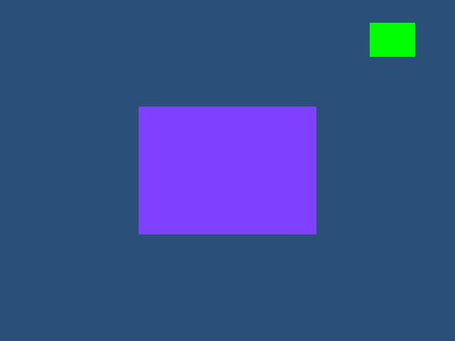


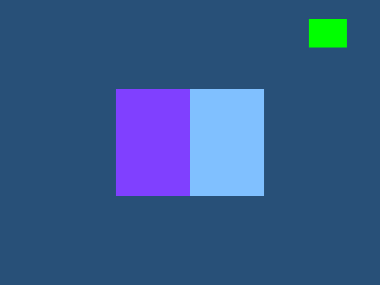

sampler検査はRelease/Debugでbyte一致した34画像を取得し、wrapの8設定と正負の整数端、指定省略時のREPEAT、同じ画像を異なる設定で描く左右の材質、基本色/MR/法線の個別sampler、拡大・縮小の補間を確認します。縮小は中心画素、拡大はモデル領域を参照と比較しています。132回の読み直しとPresent前削除を経た最後の2画像も参照と一致しました。詳しい結果は[描画検証](render-validation.md)を参照してください。

再検査は次で実行します。

```bat
ctest --test-dir build/runtime-windows -C Release -R gkcore.model_sampler --output-on-failure
ctest --test-dir build/runtime-windows-debug -C Debug -R gkcore.model_sampler --output-on-failure
```

## 同じ画像を使う材質

GLBの `textures[].source` が同じ `images` 項目を指す場合、別々のtexture indexでもPNGを1回だけ読み込んで共有します。共有範囲は1モデルの読み込み内です。別々に `LoadModel` したモデル間で共有するものではありません。基本色はsRGB、MRと法線は線形値として扱い、必要な色形式だけをGPUへ転送します。

画像の共有はUVの選択とは別に扱います。たとえば基本色・MRはUV0、法線はUV1を選べます。選択先のUV欠損や未対応の座標変換は、画像を再利用できる場合も診断します。別の `images` 項目は、PNGの内容が同じでも別画像として保持します。同じ画像を違うsamplerで参照する場合も、画像は共有し、材質のsamplerは別に保持します。

同じ画像を3種類のtextureから参照するGLBを50回新しく読み込み、同じ位置に重ねて1frameへ描画してから全モデルのhandleをPresent前に削除するケースを検査しています。旧実装は重複したGPU画像が128 entryのcache上限へ達してPresentに失敗しましたが、画像共有後は描画でき、参照画像と全画素一致しました。描画資源の保持とGLB内の画像参照共有を検査するもので、GPU性能は測定していません。

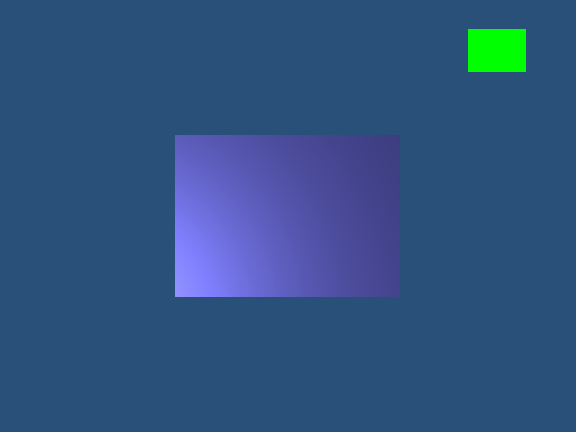

textureとimageの関係は [glTF Texture Data](https://registry.khronos.org/glTF/specs/2.0/glTF-2.0.html#textures) を参照してください。

## GLB の法線マップ

`normalTexture` のRGBを線形値として読み、接線空間の法線へ展開します。Aは使いません。`scale` は横・縦成分に掛ける有限値で、省略時は1、0や負の値にも対応します。基本色・metallic-roughness・法線画像はそれぞれ独立して `texCoord` を選べます。法線画像も埋め込みPNGを使い、UV形式と `KHR_texture_transform` の制約は基本色画像と共通です。

現在はモデルに明示したFLOAT形式の `NORMAL` と `TANGENT` が必要です。`TANGENT` は4成分で、XYZは法線に平行でない有効な方向、Wは+1か-1を指定し、同じ三角形の3頂点で揃えます。接線の自動生成は行いません。属性欠損・不正値・逆変換できないnode行列は読み込み時に診断します。node変換と描画時のモデル変換では法線と接線を別々に変換し、負のscaleによる鏡映も保持します。

内蔵モデル照明で処理するため、SceneとUIの両方で使えます。独自pixel shaderを指定した場合は既存の非照明経路へ切り替わり、法線マップの照明入力は渡されません。基本色・MR・法線に同じimageを参照するtextureを指定すると、sRGB用と線形用の2つのGPU画像を使い、MRと法線は線形画像を共有します。texture indexが別でも、同じimageの読み込み結果をモデル内で共有します。

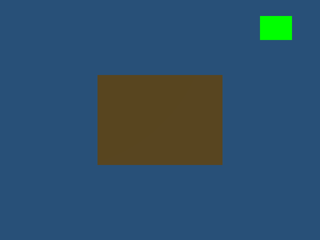


単色の法線マップと対応する頂点法線を持つ参照モデルを比較します。テスト側は接線基底の幾何変換だけを使い、照明の計算式を再実装して期待色を作りません。

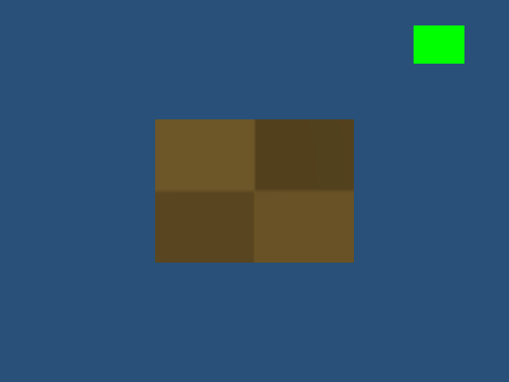

正常22・拒否12のGLBをCPUで検査し、Scene20枚、UI11枚、描画時の鏡映2枚、2種類のGLBをそれぞれ132回読み直した後の各2枚、同じframeへ50モデルを描く1枚を実GPUで確認しました。法線画像のalpha無視、scaleの0・2・負値、接線Wの符号、UV1、共有画像、nodeと描画時の鏡映を参照モデルと比較しています。Release/Debugの画像一致は[描画検証](render-validation.md)に記録しています。接線Wを意図的に無視したshaderは45,000画素の差（RGB最大18）で拒否できました。

再検査は次で実行します。実行結果と条件は[描画検証](render-validation.md)へ記録しています。

```bat
ctest --test-dir build/runtime-windows -C Release -R gkcore.model_normal --output-on-failure
ctest --test-dir build/runtime-windows-debug -C Debug -R gkcore.model_normal --output-on-failure
```

仕様の読み方は [glTF normalTexture](https://registry.khronos.org/glTF/specs/2.0/glTF-2.0.html#_material_normaltexture) を参照してください。未対応の接線自動生成を含めたglTF全体への対応を意味するものではありません。

## GLB の透明部分

glTFの `alphaMode` を省略した場合と `OPAQUE` では、画像のalphaと材質のalpha係数を無視して不透明に描きます。`MASK` では、画像のalphaに材質の基本色alpha係数を掛けた値を判定します。`alphaCutoff` を省略すると `0.5` です。判定値がcutoff未満の画素だけを描かず、cutoffと等しい画素は残します。cutoff `0` ではalpha値に関係なくすべて残り、`1`を超える有限値ではすべて抜けます。画像がない材質でも、材質alpha係数で同じ判定をします。切り抜きの判定にalphaを使いますが、残った画素のRGBをalphaで暗くしません。

SceneとUIの内蔵モデルshaderでMASKを処理します。抜いた画素はcolorだけでなくdepthも更新しないため、奥に描いた形状がその部分から見えます。次の画像はopaque描画、MASKによる切り抜き、背面モデルでdepthの状態を確かめたGPU画像です。

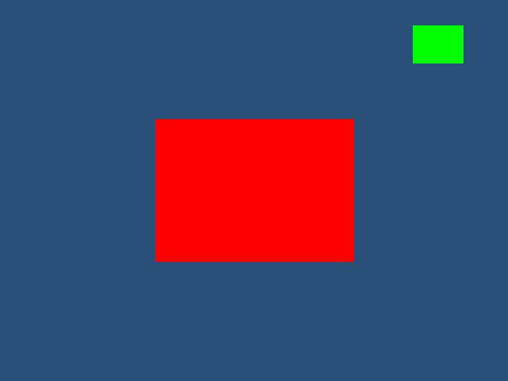

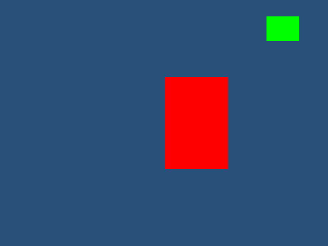

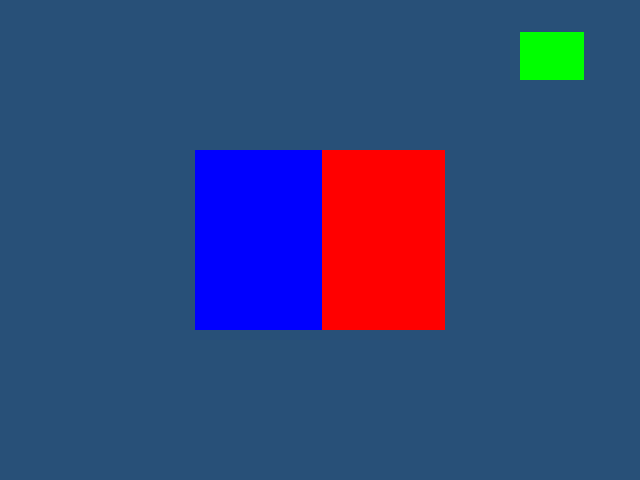

GPU検査ではScene 11画像、UI 4画像、depth検査1画像を確認しました。有限なcutoff `2` と、負または非有限なcutoffの読み込み拒否も確認しています。`BLEND` は `LoadModel` 時に診断付きで拒否します。MASKモデルを描くときに `gk::SetPixelShader` で独自pixel shaderを選んでいると、alpha情報を独自shaderへ渡すABIがないため `Present` が診断付きで拒否されます。内蔵shaderへ戻すには `gk::SetPixelShader({})` を呼んでください。ここで説明した検査は標準の `OPAQUE` と `MASK` を対象としており、glTF JSON全体のschema検証を保証するものではありません。alpha modeの仕様は[glTF 2.0仕様のAlpha Coverage](https://registry.khronos.org/glTF/specs/2.0/glTF-2.0.html#alpha-coverage)を参照してください。

## ファイルの置き方

```text
assets/
├── scene.fbx       # LoadModel へ渡すモデル
└── textures/
    ├── wall.png     # 相対パスで参照する画像
```

FBX が外部画像を参照するときは、FBX ファイルの場所を基準にした相対パスで読み込みます。絶対パスは拒否されます。モデルと画像をまとめて移動できるよう、関連ファイルは同じ `assets` フォルダーに置いてください。

FBX モデルと相対パスの画像が読み込みから描画へ進む流れです。

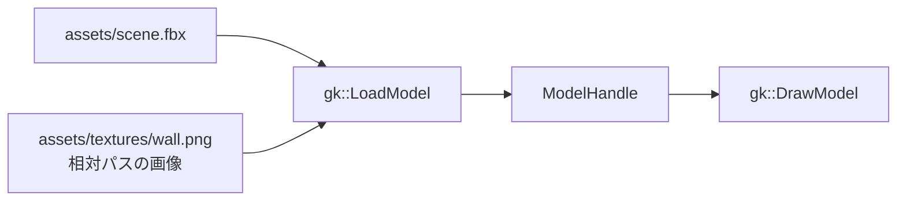

## FBX の対応範囲

FBX は ASCII 形式とバイナリ形式の静的メッシュを読み込めます。外部画像はFBXファイルの場所を基準にした相対パスで参照します。絶対パスは拒否されます。外部PNGと埋め込みPNGの取り込みをCPUテストで確認しています。FBXのUVは先頭のUVセットを使い、V座標を反転して画像の左上原点に合わせます。FBXのBMP読み込みは未確認です。

FBXのモデルは右手系のY-up、メートル単位へそろえ、階層変換とメッシュの幾何変換を反映します。材質のRGB係数は線形値、画像のRGBはsRGBとして扱います。画像は端の色で固定し、繰り返し・鏡映やUV変換は反映しません。透明度係数はアルファ値に保持しますが、アルファ合成方式の切り替えは未対応です。

モデルの材質では基本色係数とGLBのmetallic / roughness係数を使います。OBJとFBXはmetallic `0`、roughness `1` で描画します。方向光と一様な環境光による材質照明を設定できます。使い方は[モデル照明ガイド](lighting.md)を参照してください。

影、環境マップ / IBL、接線の自動生成、`BLEND`、アニメーション、スキニング、モーフターゲット、レイヤー合成、手続き的に生成する画像は未対応です。対応状況は[機能一覧](ROADMAP.md)、GPU画像を含む検証結果は[描画検証](render-validation.md)を参照してください。
