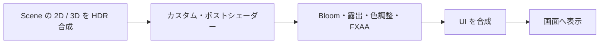

# ポストエフェクト用シェーダー

ポストエフェクト用シェーダーは、Scene 層の 2D・3D を合成した HDR 画像を一度読み、加工した色を返すピクセルシェーダーです。
描画命令用の `gk::SetPixelShader` とは別に `gk::SetPostEffectShader` で選びます。
HUD や文字を含む UI 層には適用されません。

## 入力と出力

シェーダーは `#include <gkcore/Shader.hlsl>` を使い、描画命令向けと同じ `GkcorePixelInput` を受け取ります。
フルスクリーンの入力色は白、UV は画面左上が原点です。
ポストエフェクトでは `gkcoreTexture` に Scene 層を合成した線形 RGBA16F の HDR 画像が入ります。
出力は次の Bloom、露出、色調整、FXAA の処理へ渡される線形色です。

次のサンプルは slot 0 の色倍率を Scene 全体へ適用します。

```hlsl
#include <gkcore/Shader.hlsl>
float4 main(GkcorePixelInput input) : SV_Target0
{
    const float4 scene = gkcoreTexture.Sample(gkcoreSampler, input.uv);
    const float3 tinted = scene.rgb * gkcoreUserData[0].rgb;
    return float4(tinted, scene.a);
}
```

定数は `gkcoreUserData[0..63]` の 64 個の `float4` で、`gk::SetShaderFloat4(shader, slot, value)` から設定します。
未設定の slot は 0 です。
Scene 画像は `gkcoreTexture` と sampler で読みます。
1 フレームの独自 shader 描画上限 4096 件は、描画命令用とポスト用で共通です。

## コンパイル

HLSL は開発環境のコンパイラーでコンパイルします。
DXC の実行ファイルやコンパイル用スクリプトは開発用に置き、Runtime SDK には生成された `.frag` と実行時に必要なファイルだけを含めます。

```bat
python tools/compile_pixel_shader.py --dxc-root .devtools/dxc-1.8.2405 --input examples/shaders/post_effect_tint.hlsl --output build/post_effect_tint.frag
```

この例ではリポジトリ内の [post_effect_tint.hlsl](../examples/shaders/post_effect_tint.hlsl) を使います。
コンパイル済みファイルを `gk::LoadPixelShader` に渡します。
C++ 側のサンプルは開発用実行ファイル [`gkcore_custom_post_effect`](../examples/custom_post_effect.cpp) にあります。

## アプリから使う

ポストシェーダーと定数は `gk::BeginFrame()` の時点でフレームへ取り込まれます。
選択や定数をフレーム開始後に変更した場合、その変更は次に `BeginFrame()` するフレームから反映されます。
毎フレーム値を変えるときは `BeginFrame()` より前に設定してください。

```cpp
#include <stdio.h>
#include <gkcore.h>
int main() {
    if (gk::SetWindowSize(960, 540) != 0 || gk::Init() != 0) return 1;
    const gk::ShaderHandle post = gk::LoadPixelShader("build/post_effect_tint.frag");
    if (!post.IsValid()) {
        fprintf(stderr, "%s\n", gk::GetLastErrorMessage());
        gk::Shutdown();
        return 1;
    }
    bool failed = false;
    while (gk::ProcessEvents() && !gk::IsKeyDown(gk::Key::Escape)) {
        if (gk::SetShaderFloat4(post, 0, gk::Float4{1.0f, 0.9f, 0.8f, 1.0f}) != 0 ||
            gk::SetPostEffectShader(post) != 0 ||
            gk::BeginFrame() != 0) {
            failed = true;
            break;
        }
        if (gk::SetDrawLayer(gk::DrawLayer::Scene) != 0 ||
            gk::DrawRect(40.0f, 40.0f, 220.0f, 120.0f,
                         gk::ColorRGB(255, 255, 255), true) != 0 ||
            gk::SetDrawLayer(gk::DrawLayer::UI) != 0 ||
            gk::DrawString(24.0f, 24.0f, "UI はポスト処理の対象外です",
                           gk::ColorRGB(255, 255, 255)) != 0) {
            gk::Present();
            failed = true;
            break;
        }
        if (gk::Present() != 0) {
            failed = true;
            break;
        }
    }
    if (gk::SetPostEffectShader(gk::ShaderHandle{}) != 0) failed = true;
    if (gk::DeleteShader(post) != 0) failed = true;
    gk::Shutdown();
    return failed ? 1 : 0;
}
```

`gk::SetPostEffectShader(gk::ShaderHandle{})` は以降のフレームでカスタム効果を無効にします。
描画命令用の `gk::SetPixelShader` は独立しており、どちらの設定ももう一方を変更しません。

ポスト shader の選択には初期化が必要です。
`gk::Init()` の後、各フレームの `gk::BeginFrame()` より前に `gk::SetPostEffectShader` と `gk::SetShaderFloat4` を呼びます。

開いているフレームがそのシェーダーを取り込んでいる間は、描画命令がなくても `gk::DeleteShader` は失敗します。
まず無効なハンドルを選んで以降のフレームから外し、そのフレームを `gk::Present()` した後に削除してください。

## 処理順と対応状況



これは gkcore が処理する順序です。
カスタムポストシェーダー API と CPU 契約は統合済みです。
全条件の画質評価は未実施です。
