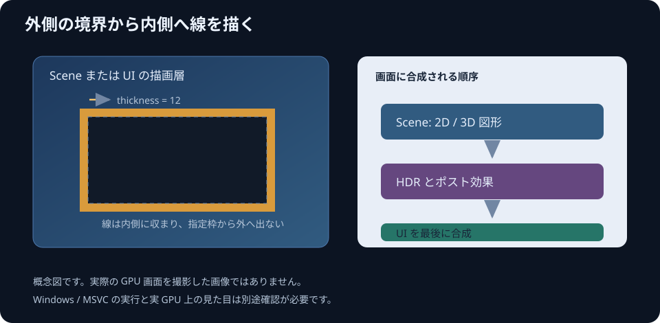

# 輪郭矩形

`gk::DrawRect` は塗りつぶし矩形を描きます。輪郭だけを描く既存の指定 `filled=false` は、内側へ 1 ピクセルの線を描きます。線の太さを調整するときは `gk::DrawRectOutline` を使います。

```cpp
gk::DrawRectOutline(40.0f, 32.0f, 240.0f, 120.0f,
                    gk::ColorRGB(240, 180, 48), 6.0f);
```

輪郭矩形の座標 `x`, `y`, `width`, `height` は外側の境界を表します。座標・寸法・`x + width`・`y + height` は有限で、幅と高さは正の値である必要があります。`thickness` も有限な正の値を指定します。線はその内側へ描くため、指定した範囲から外へはみ出しません。太さが短辺の半分以上なら、内側の領域がなくなるため矩形全体を塗りつぶします。

リポジトリの例 [rectangle_outline.cpp](../examples/rectangle_outline.cpp) は、`DrawRect(..., false)` の 1 ピクセル幅と、`DrawRectOutline` の 4 ピクセル幅を見比べられるようにしています。Scene の 3D 三角形と矩形に加え、UI にも輪郭と文字を描きます。Space キーで Scene の Bloom を切り替え、Escape キーで終了します。

輪郭矩形は通常の矩形と同じ Scene/UI の層、同じカスタム描画 shader を使う仕様です。画像・shader 用の UV 座標は外枠全体を連続して覆い、4 辺で途切れないようにします。`docs/images/rectangle-outline.svg` は線の内側方向と、Scene の後に UI を合成する順序を示す概念図です。



公開 API と packet 契約、および図形展開の外枠・内側・太さ・UV を focused CPU test で確認しています。Windows / GPU 上での表示は未確認です。最新状況は[機能一覧](ROADMAP.md)を参照してください。
