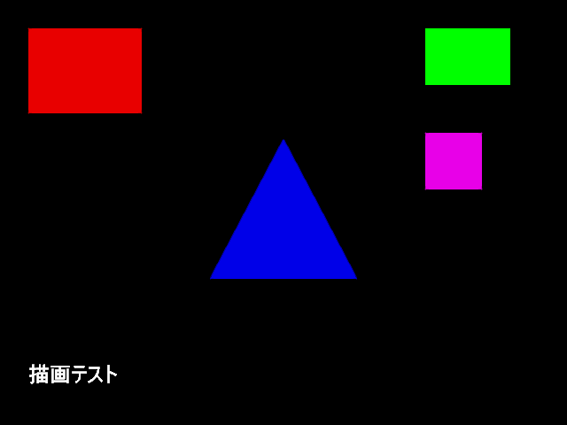
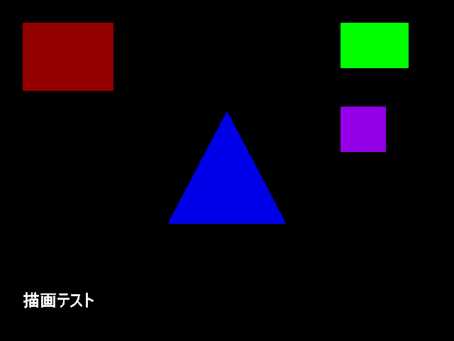
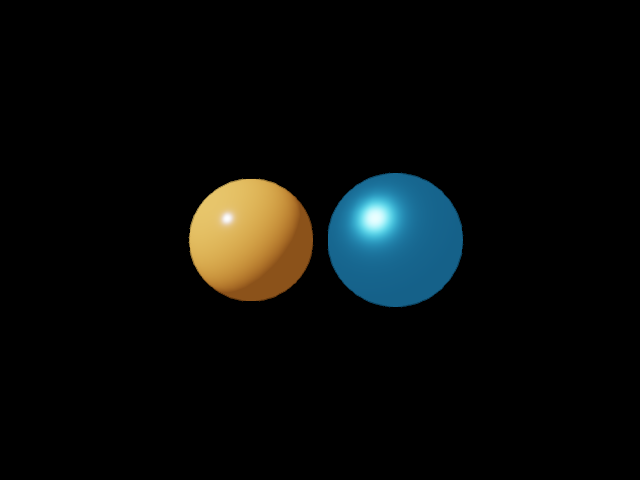
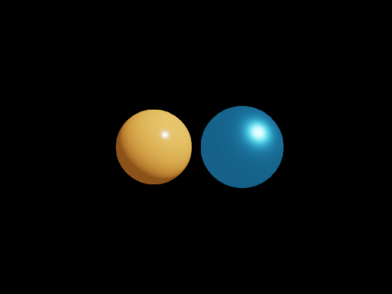

# GPUで確認した描画

Windows 11 Pro、RTX 4070 SUPER / driver 610.74で取得した実際の描画画像です。ReleaseとDebug RuntimeはVisual Studio 2026 / v142、Windows SDK 10.0.22621.0でビルドしました。画像は最終描画先から読み戻した640×480のRGBデータを、色を変えずにPNGへ保存しています。

## 基本描画とポストエフェクト

赤いScene矩形、青い3D三角形、マゼンタのPNG画像、緑のUI矩形、日本語文字を同時に描きます。通常設定とFXAAを無効にした設定の両方で、各図形の内部の色と位置、文字領域の白画素を検査します。



独自のtint処理でSceneの赤成分を下げると、矩形とPNG画像の色が変わります。処理後に重ねるUIの緑は同じ値を保ちます。テストではSceneの変化量とUIの一致を別々に判定します。



## 同じアプリ内での効果切り替え

2026-10-07に、同じアプリで6回のPresentを行い、ポスト効果を無効・有効へ交互に切り替えて各フレームを取得しました。Scene矩形の赤成分は232、149を交互に示し、UI矩形はすべてのフレームでRGB `(0, 255, 0)`を保ちました。毎回、3D・PNG画像・日本語文字の表示も判定しています。

取得枚数は開発テスト専用の設定で1〜16枚を指定でき、省略時は従来どおり1枚です。追加画像は`sequence.ppm.frame1.ppm`から連番で保存します。0、17、数値でない設定は診断付きで失敗し、画像を生成しないことを検査しています。

## Debug RuntimeとD3D12 InfoQueue

Debug構成では`_DEBUG`からThe Forgeの`FORGE_DEBUG`、`ENABLE_GRAPHICS_VALIDATION`が有効になります。Debug画像テストの13箇所で`ID3D12InfoQueue`取得成功を確認しました。固定したAgility SDKの`d3d12SDKLayers.dll`をDebug出力先へ配置しない初回はInfoQueueが取得できず、必須確認を追加したテストがPresentで失敗しました。DLLをDebug構成へstageした後は取得でき、全CTest 34/34が成功しました。Debug構成だけではInfoQueue取得を保証しません。

GPU-based validationは有効化していません。ReleaseとDebugで同一GPU・driverから取得した通常描画、direct、tint、sequence 6枚、model 2枚の計11枚のPPMはbyte単位で一致しました。この比較は画像の再現性を示し、画質の合否を示すものではありません。

## モデルの色と照明

`examples/assets/model_lighting.glb`の2球を使います。左は暖色の非金属、右は寒色の金属です。画像を持たない材質には、1×1の白い2D画像を使って材質の色を保ちます。



方向光を90度回すと、明るい側と反射の位置が変わります。左右の領域に十分な有色画素があることと、方向変更によって画素が変わることを検査します。



## 多数の描画を進めた後の確認

毎フレーム1024枚の全画面矩形を重ね、3D三角形とUIを含む描画を123フレーム続けます。通常の描画処理を119フレーム進め、フレーム119と120だけを読み戻します。両画像でSceneの青・赤の切り替え、3Dの水色、UIの緑、日本語文字を検査しています。早いフレームから画像取得のためにGPUを待つ経路は追加しません。

この確認は描画順とフレーム更新の回帰検査です。GPUの使用率、目標FPS、全フレームのちらつきや画質を測る試験ではありません。出力画像は`build/runtime-windows/frame-stress/Release`に保存します。

## 効果ごとの比較

露出・トーンマッピング・彩度・コントラスト・Bloom・FXAAを1つずつ変えた11設定と、フレーム開始後の設定変更を確認する3枚を追加しています。効果は色・明暗・にじみ・輪郭の変化で判定し、不透明なUI矩形と文字背景の領域は全設定で同じ画像を保ちました。Release/Debugの計14画像はbyte単位で一致しています。実際の画像と数値は[ポストエフェクト](effects.md)を参照してください。

## 透明UIと画像の寿命

赤い画像を青い不透明なUI背景に重ね、4段階のalpha、alphaBlend無効、1×1画像の拡大と90度回転を確認しました。Sceneに強い効果を適用しても検査対象のUI領域は同一でした。描画を登録してから画像handleを削除し、Presentまで画素が残ることと、古いhandleが拒否されることも確認しています。

画像を132フレームにわたって読み直してcacheの128枠を超えた後でも、末尾2フレームのUI画素が基準画像と一致しました。Release/Debugの取得4画像も一致しました。実画像と使い方は[画像の描画](images.md)を参照してください。

## 再実行

```bat
PRE_SETUP.bat --gpu-check
```

Debug構成では次を実行します。

```bat
PRE_SETUP.bat --configuration Debug --gpu-check
```

ビルド済みの環境で画像テストだけを実行する場合は、次を使います。

```bat
ctest --test-dir build/runtime-windows -C Release -R gkcore.render_capture --output-on-failure
```

PPM画像と判定値のJSONはReleaseでは`build/runtime-windows/render-captures/Release`、Debugでは`build/runtime-windows-debug/render-captures/Debug`へ出力します。Debug実行に必要な`d3d12SDKLayers.dll`はDebug構成の出力にだけstageします。インストール済みSDKの検査では、通常のRuntime DLLを使う別アプリをビルドし、初期化・描画・最初のPresent・終了を確認します。

この検査は代表画素と領域の条件を使います。全面画像の画質、連続フレームすべてのちらつき、PBRの物理的な正確さを判定するテストではありません。公開サンプルは起動して表示を確認し、mixed_sceneでは最大化後の表示も確認しました。輪郭サンプルではSpaceによるBloomのON→OFF→ONと短いEscape入力による終了を確認しました。全キーを実画面から操作する検査、モデル照明サンプルのキー操作、GPU-based validation、他のGPU、全モデル形式の描画は未確認です。Runtime DebugのInfoQueueと画像検査は確認済みです。

実装上の原因と修正前後の記録は[TDD検証ログ](TDD_LOG.md)、対応機能と残作業は[機能とサポート状況](ROADMAP.md)を参照してください。
